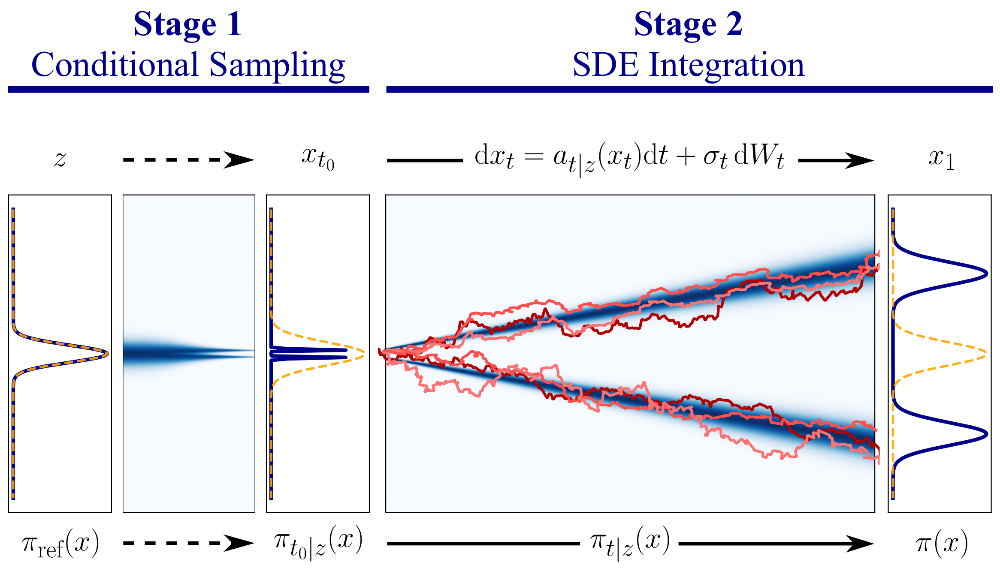

# Conditional Diffusion Sampling

    

Here you can find the code corresponding to our paper "Conditional Diffussion Sampling", accepted at ICML 2026. 

⚠️ **Important!** This code has been adapted from a larger codebase, which was used for the experiments in the paper, and was rather disorganized after the rebuttal phase. I have cleaned it and prepared for public release. If you find any issues, please let me know.